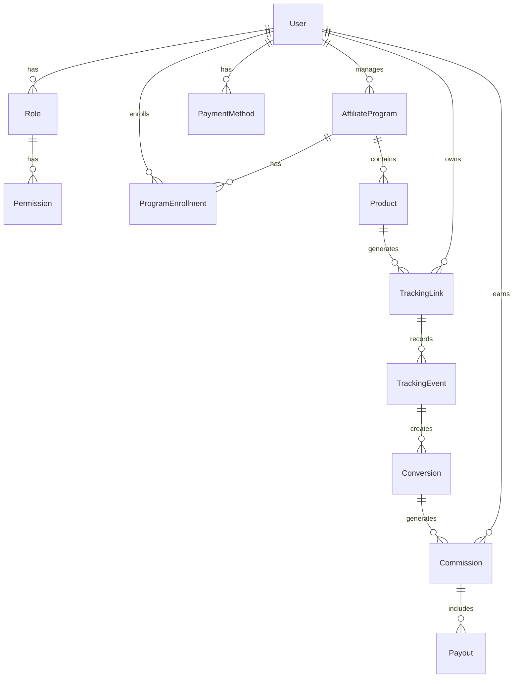

# Design Document - Affiliate Management System

## Overview

The Affiliate Management System is a centralized Laravel 12 platform that provides comprehensive affiliate program management across multiple website platforms. The system employs a modular architecture with role-based access control, multi-program support, real-time tracking, and automated commission processing. The design emphasizes scalability, security, and seamless integration with various web technologies including custom HTML, PHP, WordPress, and Joomla.

## Architecture

### System Architecture

The system follows Laravel's MVC pattern with additional service layers for business logic:

```
┌─────────────────────────────────────────────────────────────┐
│                    Presentation Layer                        │
│  ┌─────────────┐ ┌─────────────┐ ┌─────────────────────────┐ │
│  │   Web UI    │ │  REST API   │ │   Integration APIs      │ │
│  │ (Blade/Vue) │ │   (JSON)    │ │ (JS/PHP/WP/Joomla)     │ │
│  └─────────────┘ └─────────────┘ └─────────────────────────┘ │
└─────────────────────────────────────────────────────────────┘
┌─────────────────────────────────────────────────────────────┐
│                    Application Layer                         │
│  ┌─────────────┐ ┌─────────────┐ ┌─────────────────────────┐ │
│  │ Controllers │ │ Middleware  │ │      Services           │ │
│  │             │ │   (Auth,    │ │ (Business Logic)        │ │
│  │             │ │ Validation) │ │                         │ │
│  └─────────────┘ └─────────────┘ └─────────────────────────┘ │
└─────────────────────────────────────────────────────────────┘
┌─────────────────────────────────────────────────────────────┐
│                     Domain Layer                             │
│  ┌─────────────┐ ┌─────────────┐ ┌─────────────────────────┐ │
│  │   Models    │ │ Repositories│ │      Events             │ │
│  │ (Eloquent)  │ │             │ │   (Tracking,            │ │
│  │             │ │             │ │   Commissions)          │ │
│  └─────────────┘ └─────────────┘ └─────────────────────────┘ │
└─────────────────────────────────────────────────────────────┘
┌─────────────────────────────────────────────────────────────┐
│                  Infrastructure Layer                        │
│  ┌─────────────┐ ┌─────────────┐ ┌─────────────────────────┐ │
│  │   Database  │ │    Cache    │ │      Queue              │ │
│  │   (MySQL)   │ │   (Redis)   │ │   (Commission           │ │
│  │             │ │             │ │    Processing)          │ │
│  └─────────────┘ └─────────────┘ └─────────────────────────┘ │
└─────────────────────────────────────────────────────────────┘
```

### Technology Stack

- **Framework**: Laravel 12
- **Database**: MySQL 8.0+
- **Cache**: Redis
- **Queue**: Laravel Queue with Redis driver
- **Frontend**: Blade templates with Vue.js components
- **Authentication**: Laravel Sanctum for API tokens
- **File Storage**: Laravel Storage with S3 compatibility
- **Installation**: Web-based installer with step-by-step wizard
- **Deployment**: Compatible with shared hosting, VPS, and dedicated servers

## Components and Interfaces

### 1. User Management Component

**Responsibilities:**
- Role and permission management
- User authentication and authorization
- Profile management

**Key Classes:**
- `User` (Eloquent Model)
- `Role` (Eloquent Model)
- `Permission` (Eloquent Model)
- `UserService` (Business Logic)
- `RoleService` (Business Logic)

**Interfaces:**
- `UserRepositoryInterface`
- `RoleRepositoryInterface`
- `AuthenticationServiceInterface`

### 2. Affiliate Program Component

**Responsibilities:**
- Program creation and configuration
- Program visibility management
- Affiliate enrollment processing

**Key Classes:**
- `AffiliateProgram` (Eloquent Model)
- `ProgramEnrollment` (Eloquent Model)
- `ProgramService` (Business Logic)
- `EnrollmentService` (Business Logic)

**Interfaces:**
- `ProgramRepositoryInterface`
- `EnrollmentServiceInterface`

### 3. Product Management Component

**Responsibilities:**
- Product CRUD operations
- Promotional material management
- Program-product associations

**Key Classes:**
- `Product` (Eloquent Model)
- `ProductMedia` (Eloquent Model)
- `PromotionalMaterial` (Eloquent Model)
- `ProductService` (Business Logic)

**Interfaces:**
- `ProductRepositoryInterface`
- `MediaServiceInterface`

### 4. Tracking System Component

**Responsibilities:**
- Unique URL generation
- Click and conversion tracking
- Cross-platform integration

**Key Classes:**
- `TrackingLink` (Eloquent Model)
- `TrackingEvent` (Eloquent Model)
- `Conversion` (Eloquent Model)
- `TrackingService` (Business Logic)
- `IntegrationService` (Business Logic)

**Interfaces:**
- `TrackingServiceInterface`
- `ConversionTrackingInterface`

### 5. Commission System Component

**Responsibilities:**
- Commission calculation
- Earnings tracking
- Payout processing

**Key Classes:**
- `Commission` (Eloquent Model)
- `Payout` (Eloquent Model)
- `PaymentMethod` (Eloquent Model)
- `CommissionService` (Business Logic)
- `PayoutService` (Business Logic)

**Interfaces:**
- `CommissionCalculatorInterface`
- `PayoutProcessorInterface`

### 6. Reporting Component

**Responsibilities:**
- Statistics generation
- Report creation and export
- Dashboard data aggregation

**Key Classes:**
- `Report` (Eloquent Model)
- `ReportService` (Business Logic)
- `StatisticsService` (Business Logic)

**Interfaces:**
- `ReportGeneratorInterface`
- `StatisticsServiceInterface`

### 7. Installation System Component

**Responsibilities:**
- Server requirement validation
- Database setup and migration
- Email configuration testing
- Admin account creation
- Environment-specific optimization

**Key Classes:**
- `InstallationWizard` (Service)
- `ServerRequirementChecker` (Service)
- `DatabaseSetupService` (Service)
- `EmailConfigurationService` (Service)
- `AdminAccountService` (Service)

**Interfaces:**
- `InstallationServiceInterface`
- `RequirementCheckerInterface`
- `EnvironmentSetupInterface`

**Installation Flow:**
1. **Pre-Installation Check**: Validate server requirements (PHP version, extensions, permissions)
2. **Database Configuration**: Test connection, create database if needed, run migrations
3. **Email Setup**: Configure and test SMTP settings
4. **Admin Account**: Create initial administrator with secure credentials
5. **System Configuration**: Set up environment-specific optimizations
6. **Final Verification**: Run system health checks and complete installation

**Hosting Environment Support:**
- **Shared Hosting**: Handle limited permissions, optimize for shared resources
- **VPS**: Configure for better performance and security
- **Dedicated Server**: Full optimization with advanced caching and queue configuration

## Data Models

### Core Entity Relationships



### Database Schema

**users**
- id (primary key)
- name, email, password
- role_id (foreign key)
- email_verified_at
- created_at, updated_at

**roles**
- id (primary key)
- name, description
- permissions (JSON)
- created_at, updated_at

**affiliate_programs**
- id (primary key)
- name, description
- program_type (enum: sale, view, lead)
- commission_type (enum: flat, percentage)
- commission_amount (decimal)
- visibility (enum: hidden, open)
- invitation_code (nullable)
- created_by (foreign key to users)
- created_at, updated_at

**products**
- id (primary key)
- name, description
- website_url
- images (JSON)
- promotional_materials (JSON)
- created_at, updated_at

**program_products** (pivot table)
- program_id (foreign key)
- product_id (foreign key)
- created_at

**program_enrollments**
- id (primary key)
- user_id (foreign key)
- program_id (foreign key)
- status (enum: pending, approved, rejected)
- enrolled_at
- created_at, updated_at

**tracking_links**
- id (primary key)
- user_id (foreign key)
- product_id (foreign key)
- program_id (foreign key)
- unique_code (unique)
- tracking_url
- created_at, updated_at

**tracking_events**
- id (primary key)
- tracking_link_id (foreign key)
- event_type (enum: click, view, conversion)
- ip_address
- user_agent
- referrer
- created_at

**conversions**
- id (primary key)
- tracking_event_id (foreign key)
- conversion_value (decimal)
- conversion_data (JSON)
- created_at

**commissions**
- id (primary key)
- user_id (foreign key)
- conversion_id (foreign key)
- amount (decimal)
- status (enum: pending, approved, paid)
- created_at, updated_at

**payouts**
- id (primary key)
- user_id (foreign key)
- total_amount (decimal)
- commission_ids (JSON)
- payment_method_id (foreign key)
- status (enum: pending, processing, completed, failed)
- processed_at
- created_at, updated_at

**payment_methods**
- id (primary key)
- user_id (foreign key)
- type (enum: bank, paypal, wise)
- details (JSON, encrypted)
- is_active (boolean)
- created_at, updated_at

**installation_logs**
- id (primary key)
- step (varchar)
- status (enum: pending, completed, failed)
- message (text)
- details (JSON)
- created_at

**system_settings**
- id (primary key)
- key (varchar, unique)
- value (text)
- type (enum: string, integer, boolean, json)
- is_public (boolean)
- created_at, updated_at

## Correctness Properties

*A property is a characteristic or behavior that should hold true across all valid executions of a system-essentially, a formal statement about what the system should do. Properties serve as the bridge between human-readable specifications and machine-verifiable correctness guarantees.*

### Property Reflection

After analyzing all acceptance criteria, several properties can be consolidated to eliminate redundancy:

- Role creation and permission enforcement properties (1.2, 1.3, 1.4) can be combined into comprehensive role management properties
- Program visibility properties (2.3, 2.4) can be merged into a single visibility behavior property
- Product-program relationship properties (3.3, 3.4) can be consolidated into product availability property
- Tracking URL properties (4.1, 4.5) can be combined into unique identifier generation property
- Integration properties (7.1, 7.2, 7.3, 7.4) can be consolidated into platform compatibility property

### Core Properties

**Property 1: Role Management Consistency**
*For any* role creation or modification, all users assigned to that role should have their permissions updated to match the role's current permission set
**Validates: Requirements 1.2, 1.3, 1.4**

**Property 2: Access Control Enforcement**
*For any* user attempting to access functionality, access should be granted if and only if their role permissions allow it, and unauthorized attempts should be logged
**Validates: Requirements 1.5**

**Property 3: Program Configuration Integrity**
*For any* affiliate program creation, the program should be stored with exactly one of the valid program types (Pay Per Sale, Pay Per View, Pay Per Lead) and exactly one of the valid commission types (flat rate, percentage)
**Validates: Requirements 2.1, 2.2**

**Property 4: Program Visibility Behavior**
*For any* affiliate program, if visibility is set to hidden then enrollment should require invitation links, and if visibility is set to open then marketplace applications should be allowed
**Validates: Requirements 2.3, 2.4**

**Property 5: Application Processing Completeness**
*For any* affiliate application to join an open program, the system should process the application and send notifications to all relevant parties
**Validates: Requirements 2.5**

**Property 6: Product Data Integrity**
*For any* product creation, all required fields (name, description, images, website URL) should be stored and retrievable
**Validates: Requirements 3.1**

**Property 7: Product-Program Relationship Enforcement**
*For any* product, it should be available for promotion if and only if it is assigned to at least one affiliate program, and should be accessible to all participants of assigned programs
**Validates: Requirements 3.3, 3.4**

**Property 8: Product Update Consistency**
*For any* product information update, all associated tracking links should reflect the updated information
**Validates: Requirements 3.5**

**Property 9: Promotional Material Access Control**
*For any* uploaded promotional materials, they should be accessible to authorized affiliates and inaccessible to unauthorized users
**Validates: Requirements 3.2**

**Property 10: Unique Tracking URL Generation**
*For any* affiliate-product combination, the system should generate a unique tracking URL that is different from all other tracking URLs in the system
**Validates: Requirements 4.1, 4.5**

**Property 11: Tracking Event Recording**
*For any* tracking URL access, the system should record the visit with correct affiliate association and timestamp
**Validates: Requirements 4.2**

**Property 12: Commission Calculation Accuracy**
*For any* conversion through a tracking URL, the calculated commission should match the program's commission structure (type and amount) applied to the conversion value
**Validates: Requirements 4.3**

**Property 13: Cross-Platform Integration Compatibility**
*For any* integration with external platforms (HTML, PHP, WordPress, Joomla), the tracking functionality should work correctly and maintain consistent data collection
**Validates: Requirements 4.4, 7.1, 7.2, 7.3, 7.4, 7.5**

**Property 14: Report Data Completeness**
*For any* generated report, it should contain all required data elements (sales data, conversion rates, commission information) relevant to the report scope
**Validates: Requirements 5.1**

**Property 15: Statistics Aggregation Accuracy**
*For any* system-wide statistics request, the aggregated data should correctly represent the sum/average/count of all relevant data across programs and affiliates
**Validates: Requirements 5.2**

**Property 16: Personalized Dashboard Data**
*For any* affiliate viewing their dashboard, the displayed metrics and earnings should include only data belonging to that specific affiliate
**Validates: Requirements 5.3**

**Property 17: Report Filtering Functionality**
*For any* report filtering operation, the results should include only data that matches all applied filters (date ranges, programs, products)
**Validates: Requirements 5.4**

**Property 18: Report Export Integrity**
*For any* report export operation, the exported data should maintain the same accuracy and completeness as the original report in a valid format
**Validates: Requirements 5.5**

**Property 19: Payment Information Validation**
*For any* payment method setup or update, the system should validate the payment details according to the payment type requirements before saving
**Validates: Requirements 6.1, 6.4**

**Property 20: Commission Tracking Accuracy**
*For any* commission earning event, the affiliate's accumulated earnings should increase by exactly the calculated commission amount
**Validates: Requirements 6.2**

**Property 21: Automated Payout Processing**
*For any* affiliate whose accumulated earnings meet the payout threshold, the system should initiate payout processing according to the configured schedule
**Validates: Requirements 6.3**

**Property 22: Transaction Record Completeness**
*For any* payout processing event, the system should create and maintain detailed transaction records containing all relevant information for auditing purposes
**Validates: Requirements 6.5**

**Property 23: Server Requirement Validation**
*For any* installation attempt, the system should accurately check all Laravel 12 server requirements and provide specific guidance for any missing requirements
**Validates: Requirements 8.1, 8.2**

**Property 24: Database Setup Integrity**
*For any* database configuration during installation, the system should validate connectivity and successfully create all required tables and initial data
**Validates: Requirements 8.3**

**Property 25: Email Configuration Validation**
*For any* email setup during installation, the system should test connectivity and validate SMTP settings before proceeding
**Validates: Requirements 8.4**

**Property 26: Admin Account Security**
*For any* admin account creation during installation, the system should enforce secure credential requirements and create the account with proper permissions
**Validates: Requirements 8.5**

**Property 27: Environment-Specific Optimization**
*For any* deployment environment (shared hosting, VPS, dedicated), the system should apply appropriate configuration optimizations and handle environment-specific limitations
**Validates: Requirements 8.6, 8.7**

## Error Handling

### Exception Handling Strategy

**Database Exceptions:**
- Connection failures: Implement retry logic with exponential backoff
- Constraint violations: Return user-friendly error messages
- Transaction failures: Automatic rollback with error logging

**Validation Errors:**
- Input validation: Return specific field-level error messages
- Business rule violations: Clear explanations of rule violations
- File upload errors: Size and type validation with appropriate messages

**External Integration Errors:**
- API failures: Graceful degradation with fallback mechanisms
- Network timeouts: Retry logic with circuit breaker pattern
- Third-party service unavailability: Queue operations for later processing

**Security Exceptions:**
- Authentication failures: Rate limiting and logging
- Authorization violations: Access denial with audit trail
- CSRF attacks: Token validation with clear error messages

### Error Response Format

```json
{
  "success": false,
  "error": {
    "code": "VALIDATION_ERROR",
    "message": "The given data was invalid.",
    "details": {
      "email": ["The email field is required."],
      "commission_amount": ["The commission amount must be greater than 0."]
    }
  },
  "timestamp": "2024-01-15T10:30:00Z",
  "request_id": "req_123456789"
}
```

## Testing Strategy

### Dual Testing Approach

The system will employ both unit testing and property-based testing to ensure comprehensive coverage:

**Unit Testing:**
- Specific examples demonstrating correct behavior
- Edge cases and boundary conditions
- Integration points between components
- Error handling scenarios

**Property-Based Testing:**
- Universal properties that should hold across all inputs
- Automated generation of test cases
- Verification of correctness properties defined above
- Minimum 100 iterations per property test

### Property-Based Testing Framework

**Framework:** Laravel with Pest PHP and Eris (Property-Based Testing library for PHP)

**Configuration:**
- Each property-based test will run a minimum of 100 iterations
- Tests will be tagged with comments referencing design document properties
- Tag format: `**Feature: affiliate-management-system, Property {number}: {property_text}**`

**Test Organization:**
- Unit tests: Located in `tests/Unit/` directory
- Property tests: Located in `tests/Property/` directory
- Integration tests: Located in `tests/Feature/` directory

### Testing Requirements

- Each correctness property must be implemented by a single property-based test
- Property-based tests must generate diverse input data to thoroughly test properties
- Unit tests complement property tests by covering specific scenarios and edge cases
- All tests must pass before deployment
- Test coverage should maintain minimum 80% code coverage
- Critical business logic must have both unit and property test coverage

### Test Data Generation

**Generators for Property Tests:**
- User data: Random names, emails, roles
- Program data: Random configurations, commission structures
- Product data: Random names, descriptions, URLs
- Tracking data: Random affiliate-product combinations
- Financial data: Random commission amounts, conversion values

**Test Database:**
- Separate test database for isolation
- Database transactions for test cleanup
- Factory classes for consistent test data generation
- Seeders for baseline test data scenarios